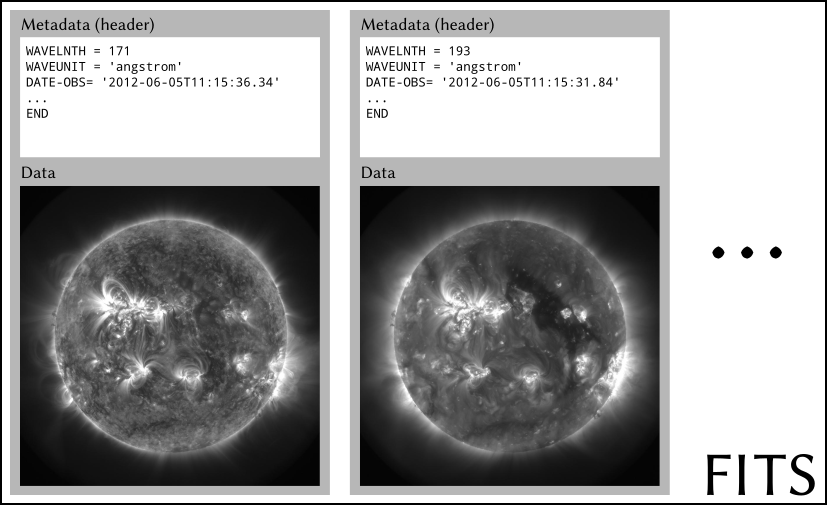

---
title: Bases de Python pour l’astronomie
date: Septembre 2018
shortauthor: G. Pelouze
author:
    - Gabriel Pelouze (gabriel.pelouze@ias.u-psud.fr)
mainlang: french
...

# Introduction

## Exécuter du code

### IPython : la console interactive

Pour lancer IPython, ouvrir un terminal et exécuter :

~~~bash
$ ipython3
~~~

on accède alors à l’invite de comande IPython :

~~~python
In [1]: # où l’on peut exécuter du code !
~~~

### Écrire un script

Par exemple, créer le fichier `hello.py`, et y ajouter :

~~~python
#!/usr/bin/env python3
print('Hello, world!')
~~~

On peut ensuite l’exécuter de deux manières :

- soit depuis le terminal :

~~~bash
$ python3 hello.py
Hello, world!
~~~

- soit depuis IPython :

~~~bash
In [1]: %run hello.py
Hello, world!
~~~

## Commenter et obtenir de l’aide

### Commentaires

En Python, les commentaires commencent par un croisillon (`#`) :

~~~python
#!/usr/bin/env python3
print('Hello') # commentaire en fin de ligne
# Commentaire occupant une ligne à lui tout seul.
def fonction():
  ''' Les “docstrings” sont des chaines de
  caractères qui documentent les fonctions.
  Comme les commentaires, elles ne sont pas exécutées,
  mais elles sont affichées lorsqu’on demande de la
  documentation de la fonction (voir ci-dessous)
  '''
  pass # cette fonction ne fait rien
~~~

### Obtenir de l’aide

Pour obtenir de l’aide d’une fonction dans IPython, il suffit de taper le nom
de la fonction suivi d’un point d’interrogation. Par exemple, pour la fonction
`sum` :

~~~python
In [5]: sum?
Signature: sum(iterable, start=0, /)
Docstring:
Return the sum of a 'start' value (default: 0) plus an iterable of numbers

When the iterable is empty, return the start value.
This function is intended specifically for use with numeric values and may
reject non-numeric types.
Type:      builtin_function_or_method
~~~

# Variables

## Assignation et affichage

Assignation :

~~~python
variable = <valeur>
~~~

Affichage :

~~~python
print(variable)
~~~

Exemple :

~~~python
In [1]: variable = 1
In [3]: autre_variable = 'toto'
In [2]: print(variable, autre_variable)
1 toto
In [4]: variable = autre_variable
In [5]: print(variable, autre_variable)
toto toto
~~~

**Remarque importante :** donnez des noms **explicites** à vos variables, cela
permettra que votre code soit plus lisible (pour vous et pour les autres), et
vous évitera de faire des erreurs.
Il vaut mieux perdre quelques secondes en écrivant `master_dark`, que de perdre
30 minutes à comprendre que vous obtenez des résultats aberrants car que vous
avez confondu `md` avec `Md`.

## Opérations arithmétiques

Addition, soustraction, multiplication, division :

~~~python
(17-31) * (2+4) / 2 # -> -42.0
~~~

Exposant :

~~~python
2**12 # -> 4096
~~~

Division euclidienne :

~~~python
13 // 3 # -> 4
~~~

Modulo (reste de la division euclidienne) :

~~~python
13 % 3 # -> 1
~~~

Certaines opérations ne sont pas limités aux nombres. Par exemple, `+` sert à
concaténer les listes et les chaînes de caractères, et `*` à répéter une
chaines de caractères:

~~~python
'tutu' + 'tata'  # -> 'tututata'
'la' * 8 # -> 'lalalalalalalala'
[1, 2, 3] + [-1, -2, -3] # -> [1, 2, 3, -1, -2, -3]
~~~

## Types de variables par défaut

Nom                     Notation            Exemples
---------------         ------------------- ------------------------------------------
Entiers                 `int`               `1`, `int(1)`
Nombres à virgule       `float`             `1.0`, `1e4`, `float(42)`
Booléens                `bool`              `True`, `False`, `bool(1)`
None                    `None`
Chaines de caractères   `str`               `'Toto'`, `"Tutu"`, `str(14)`
Tuple                   `tuple`             `1, 2, 3`, `(1, 'toto', True)`, `tuple('truc')`
Dictionnaire            `dict`              (voir plus bas)
Liste                   `list`              (voir plus bas)

Exemple dictionnaire :

~~~python
d = {'nom': 'Python'}
d['version'] = 3.5
print(d) # -> {'nom': 'Python', 'version': 3.5}
print(d['nom']) # -> 'Python'
print(d.keys()) # -> dict_keys(['nom', 'version'])
print(d.values()) # -> dict_values(['Python', 3.5])
print(d.items()) # -> dict_items([('nom', 'Python'),
                                # ('version', 3.5)])
~~~

Exemple liste :

~~~python
l = [13, 'bonjour', 1e5]
l[0] # -> 13 (on compte à partir de 0)
l[-1] # -> 1e5 (on peut aussi compter depuis la fin)
l[2] = 'bonsoir' # assignation
l.append('au revoir') # ajout d'un élément à la fin
l.remove(13) # retrait d'un élément
l # -> ['bonjour', 'bonsoir', 'au revoir']
len(l) # -> 3
~~~

*Slicing* de listes `liste[début:fin:pas]`

~~~python
l = [0, 1, 2, 3, 4, 5]
l[2:] # -> [2, 3, 4, 5] : à partir de l’élément #2
l[:2] # -> [0, 1] : jusqu’à l’élément #2 (exclus)
l[:-2] # -> [0, 1, 2, 3] : jusqu’à l’avant dernier élément
l[1:4:2] # -> [1, 3] : de l’élément #1 au #4, de 2 en 2
l[::-1] # -> [5, 4, 3, 2, 1, 0] : liste renversée
~~~

D’autres méthodes intéressantes pour les listes: `l.index`, `l.count`,
`l.reverse`, `l.insert`, `l.sort`.

# Tests et boucles

## Tests `if`

Syntaxe :

~~~python
if <condition>:
  <expression>
elif <autre condition>:
  <autre expression>
else:
  <expression par défaut>
~~~

Exemple :

~~~python
print('Réponse:')
r = input('r = ')
if r < 42:
  print('Plus grand.')
elif r > 42:
  print('Plus petit.')
else:
  print('Bravo!')
~~~

Remarques :

- On peut bien sûr se contenter d’un `if/else`, ou d’un `if/elif`.
- L’**indentation** fait partie de la syntaxe en Python : c’est elle
qui permet de délimiter les blocs sémantiques.

## Opérations logique

Ces opérateurs peuvent être utilisés pour écrire des conditions :

Opérateur                           Description
----------------------------------- ------------------------------------------
`or`                                OU booléen
`and`                               ET booléen
`not`                               négation booléenne
`<`, `<=`, `>`, `>=`, `!=`, `==`    comparaisons
`is`, `is not`                      identité
`in`, `not in`                      inclusion

**Attention :** Ne pas confondre avec les opérateurs *bit à bit* (*bitwise*)
`|`, `&`, et `~`, qui s’appliquent terme à terme sur la représentation binaire
d’un nombre, ou sur les éléments des tableaux dont nous parlerons plus loin.

## Boucles

### Boucle `while`

~~~python
i = 0
while i < 3:
  print(i)
  i += 1
~~~

### Boucle `for`

En Python, `for` ne sert pas qu’à itérer sur des entiers, mais à **itérer** sur
tous les éléments d’un objet :

~~~python
for value in (1, 3, 4, 'cinq'):
  print(value)
# -> Affiche à chaque tour : 1 · 2 · 3 · 4 · cinq
~~~

~~~python
for character in 'hello':
  print(character)
# -> h · e · l · l · o
~~~

Pour itérer sur des entiers, on peut utiliser `range`, mais il est souvent
possible de s’en passer.

~~~python
for i in range(9):
  print(i)
# -> 0, 1, ... 8
~~~

~~~python
for i in range(2, 9):
  print(i)
# -> 2, 3, ... 8
~~~

`enumerate`, pour itérer sur les éléments d’un objet avec un compteur :

~~~python
for i, char in enumerate('hello'):
  print(i, char)
# -> Affiche :
# 0 h
# 1 e
# 2 l
# 3 l
# 4 o
~~~

`zip` pour itérer sur deux objets à la fois :

~~~python
for n, c in zip([2,8,9,2,0], 'hello'):
  print(n, c)
# -> Affiche
# 2 h
# 8 e
# 9 l
# 2 l
# 0 o
~~~

# Lecture et écriture de fichiers

## Lecture

~~~python
with open('fichier.txt') as f:
  data = f.readlines()
~~~

## Écriture

~~~python
# remplacer fichier.txt s’il existe
with open('fichier.txt', 'w') as f:
  f.write(data)
  f.readlines(data_list)

# écrire à la suite de fichier.txt
with open('fichier.txt', 'a') as f:
  f.write(data)
  f.readlines(data_list)
~~~

# Fonctions

~~~python
def affine(x, a, b=0):
  ''' Evaluates an affine function

  The image is computed using y = a*x + b. If the y-intercept is is assumed to
  be zero.

  Parameters
  ==========
  x : float
    The abscissa.
  a : float
    The slope.
  b : float (default: 0)
    The y-intercept.

  Returns
  =======
  y : float
    The image of x by the affine function.
  '''
  y = a * x + b
  return y

y = affine(2, 2) # -> 4
y = affine(2, 2, b=-1) # -> 3
~~~

- Une fonction n’a pas obligatoirement d’arguments.
- Une fonction ne termine pas toujours par un `return` (dans ce cas, `None` est
  renvoyé)
- Écrire une *docstring* (la documentation au début de la fonction) est
  **extrêmement très beaucoup fortement recommandé avec insistance**. Pour ne
  pas que vos camarades, vos professeurs, ou même vous dans deux semaines ne
  perdent de temps à essayer de comprendre ce que fait une fonction, quels
  paramètres elle attend, et quelles valeurs elle renvoie.

  Une bonne docstring contient :
    - une phrase courte décrivant ce que fait la fonction ;
    - si nécessaire, une description un peu plus longue juste dessous ;
    - une liste des paramètres d’entrée, avec une indication du type attendu,
      et courte description de ce que représente la valeur
    - une liste des paramètres de sortie, avec les mêmes informations que pour
      les paramètres d’entrée.

  Il n’est pas rare que la docstring soit plus longue que le code de fonction
  (même si l’exemple ci-dessus est un peu pathologique).

<!--
% Classes
-->

# Modules

De nombreux modules fournissent des fonctions et des classes qui permettent
d’élargir considérablement les possibilités de Python. Il suffit d’utiliser
`import` en début de code pour y avoir accès.

## Exemples

~~~python
import numpy
numpy.sqrt(2)
~~~

~~~python
import numpy as np
np.sqrt(2)
~~~

# Modules scientifiques

## `numpy`, pour manipuler des tableaux

Numpy (abrégé `np`), fournit de nombreux outils numériques, notamment une
classe tableaux très flexible : `ndarray`.

~~~python
import numpy as np

# création d’un tableau non initialisé de dimension 2×3:
a = np.ndarray((2, 3))
# -> array([[ 0, 0, 0],
#           [ 0, 0, 0]])

# création d’un tableau depuis une liste
b = np.array([[1, 2, 3], [4, 5, 6]])
# -> array([[1, 2, 3],
#           [4, 5, 6]])

# addition d’un scalaire
a = a + 2
# -> array([[2, 2, 2],
#           [2, 2, 2]])

# addition terme à terme
a + b
# -> array([[3, 4, 5],
#           [6, 7, 8]])

# multiplication terme à terme
a * b
# -> array([[2,  4,  6],
#           [8, 10, 12]])

# transposée et multiplication matricielle
a @ b.T
# -> array([[12, 30],
#           [12, 30]])

# renvoie les dimensions du tableau
a.shape
# -> (2, 3)
~~~

**Attention :** bien que semblables, `np.ndarray` et `np.array` ont des
comportements bien différents (voir les exemples ci-dessus).

Numpy fournit de nombreuses autres fonctions et variables, par exemple :
`sqrt`, `exp`, `log`, `pi`, `mean`, `median`, `std`.

## `matplotlib`, pour faire des figures

Matplotlib est une bibliothèque très complète (un peu complexe), qui permet
de réaliser toute sorte de figures.

Par convention, on utilisera : `import matplotlib.pyplot as plt`

### Exemple 1 : Graphique 1D classique

~~~python
# initialisation
import matplotlib.pyplot as plt
plt.ion() # afficher les figures dans une fenêtre au fur et à mesure
plt.figure(1) # sélectionne la figure n°1
plt.clf() # efface la figure (au cas où on aurait affiché des choses avant)

# on génère des données à afficher
x = np.arange(0, 10, 0.4)
y = np.arange(-10, 10, 0.8)

plt.plot(x, y, 'o', label='x, y')
plt.plot(y, x, '-o', label='y, x')
plt.plot(x, y**2, '-', label='x, y²')

plt.title('Essai Matplotlib')
plt.xlabel('abscisse')
plt.ylabel('ordonnée')
plt.legend(loc='best')
~~~

### Exemple 2 : Afficher une image

~~~python
import matplotlib.pyplot as plt
plt.ion() # mode interactif

xy = np.random.rand(10, 10)

plt.imshow(xy,
  interpolation='none', origin='lower', cmap='viridis')

cb = plt.colorbar()
cb.set_label('Intensité')
~~~

### Gestion des figures

On peut avoir besoin d’afficher plusieurs figures à la fois. Dans ce cas,
changer de figure en utilisant `plt.figure(<numéro>)` :

~~~python
# utiliser la figure n°2
plt.figure(2)
# effacer la figure en cours
plt.clf()
~~~

## `astropy`, une collection d’outils pour l’astronomie

### Le format [FITS](https://fr.wikipedia.org/wiki/Flexible_Image_Transport_System)

### Lire des FITS

~~~python
from astropy.io import fits
f = fits.open('data/NVSSJ201943-364542.fits')
f.info() # affiche une synthèse du contenu du fichier
hdu = f[0] # sélectionne le 1er HDU du FITS
data = hdu.data # tableau contenant les données
header = hdu.header # dictionnaire contenant l’en-tête
~~~

### Un peu de cosmologie

(Pour les TP traitement de données “Trou noir”.)

~~~python
from astropy.cosmology import Planck15 as cosmo
print(cosmo)
# -> FlatLambdaCDM(name="Planck15", H0=67.7 km / (Mpc s),
#                  Om0=0.307, Tcmb0=2.725 K, Neff=3.05,
#                  m_nu=[ 0.  0.  0.06] eV, Ob0=0.0486)
z = 1.7
cosmo.luminosity_distance(z) # -> 13.1 Gpc
~~~

## Ajustement de modèles par la méthode des moindres carrés avec `scipy.optimize`

On génère des données à ajuster, et on définit la fonction à utiliser :

~~~python
x = np.arange(10, 20, .1)
y = 2.17 * x + 5.14 + (np.random.rand(100) - .5)
def linear_model(x, a, b):
  return a * x + b
~~~

On ajuste avec `curve_fit`, qui prend comme arguments :

- la fonction d’ajustement
- le tableau des valeurs de $x$
- le tableau des valeurs de $y$
- des valeurs initiales pour les paramètres à ajuster (ici, $a$ et $b$)

~~~python
from scipy.optimize import curve_fit
param_optimal, param_covariance = curve_fit(linear_model, x, y, p0=(3, 8))
~~~

- `param_optimal` contient les valeurs optimales des paramètres
- `param_covariance` est la matrice de covariance des paramètres

La diagonale de la matrice de covariance contient les variances des paramètres.
On peut donc estimer l’incertitude sur les valeurs optimales :

~~~python
param_uncertainty = np.sqrt(np.diag(param_covariance))
~~~
